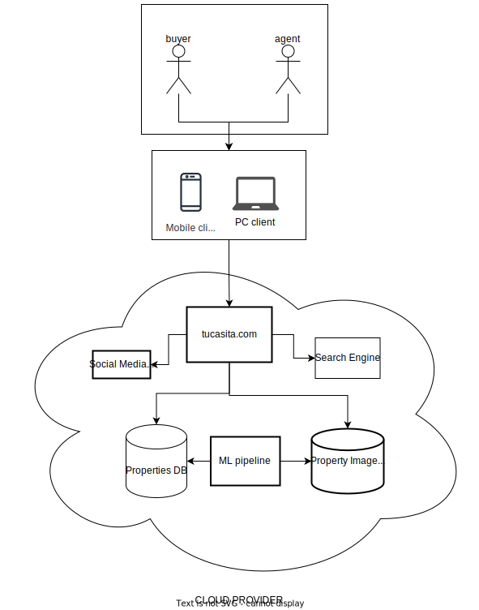
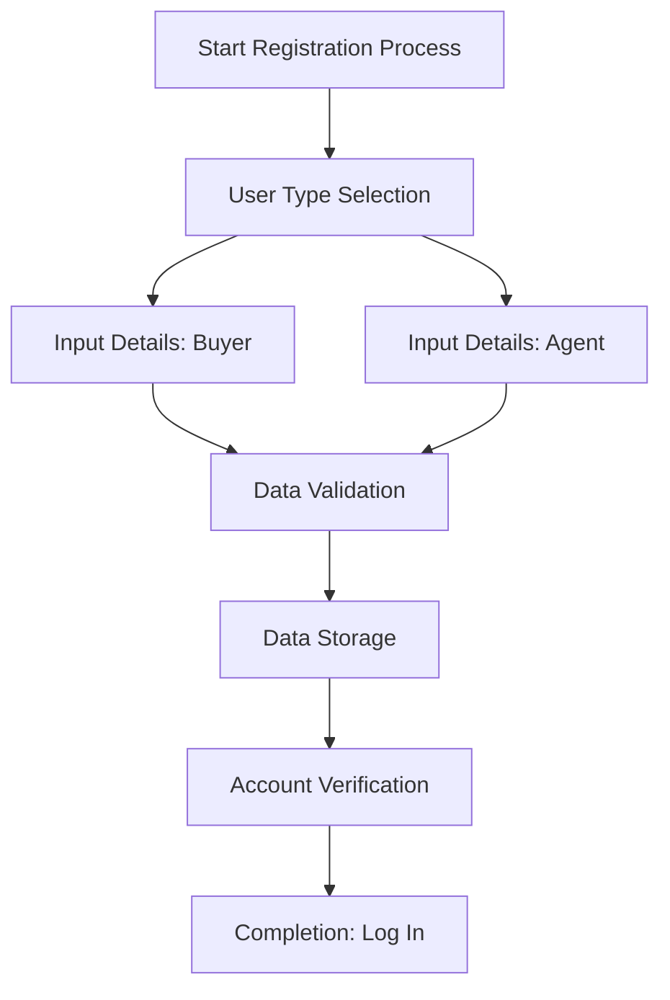
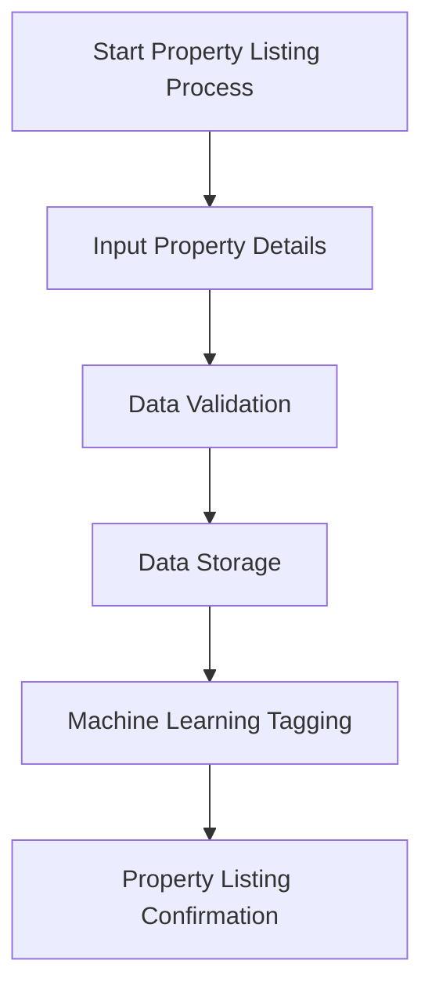
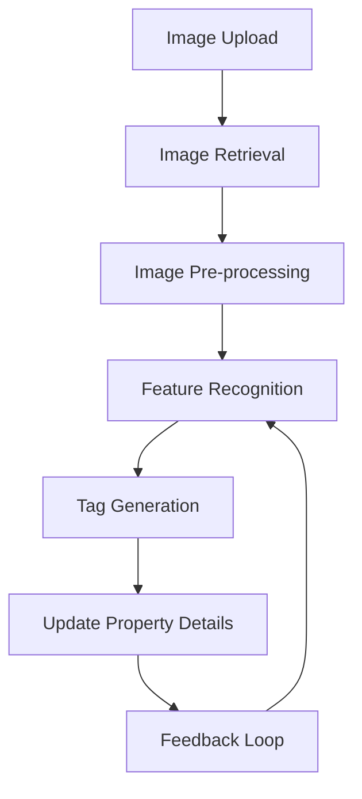
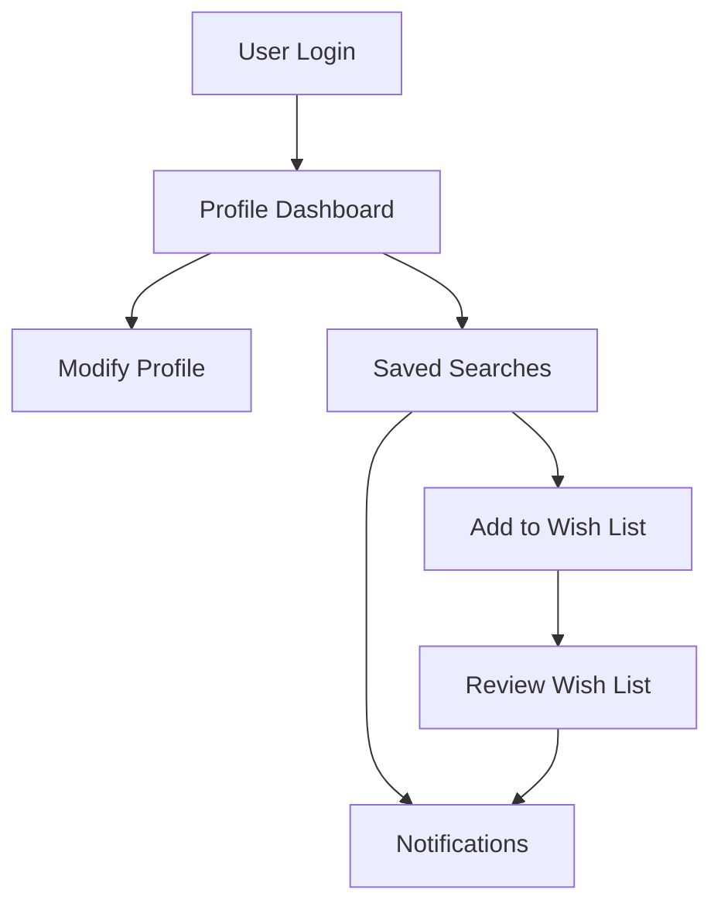
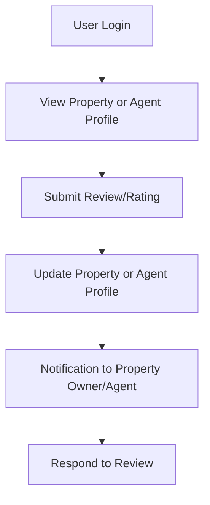
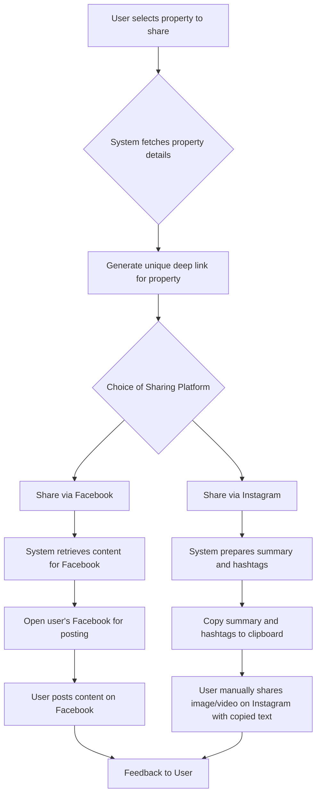

# Product Specification for tucasita.com

## 1. Introduction

### Purpose
The purpose of this product specification is to provide a detailed overview of the system's functionality, structure, and requirements. This document aims to be a reference point for stakeholders, developers, designers, and other teams involved in the development, maintenance, and enhancement of tucasita.com.

### Scope
* The platform will allow only registered agents to list properties.
* Buyers can register to save lists of properties they are interested into.
* Unregistered users can view listings but cannot post them. 
* Registered users can save and share properties on social media platforms, including but not limited to Facebook and TikTok.

## 2. Product Overview

### System Context
All will be hosted in a Cloud provider to allow flexibility and scale, reducing hosting costs of an on-premise environment. 

Entities:
1. Users: agents and buyers interacting with the website
1. Databases: For storing properties, user agents, and buyer data.
1. Social Media Connections: Interfaces allowing users to share properties directly on platforms like Facebook and TikTok.
1. Image Storage: Used for storing images related to property listings.
1. User Devices: Laptops and mobile devices that buyers and agents use to interact with the platform.
1. Data and ML pipelines: Utilized for analyzing property images to identify specific features.
1. Search Engine: allows searching on the website based on tags or relevant text

## 3. Functional Requirements
### Product Features

#### 1. User Registration for Agents and Buyers:
- **User Story 1**: As a property agent, I want to register on the platform so that I can list properties for sale.
- **User Story 2**: As a potential buyer, I want to create an account so that I can save and manage my property preferences.

#### 2. Property Listing with Multimedia Support:
- **User Story 1**: As an agent, I want to add multimedia elements (photos, videos) to my property listings to give potential buyers a comprehensive view.
- **User Story 2**: As an agent, I want to edit or remove my property listings to ensure the information is up-to-date and relevant.

#### 3. Search Functionality with Text and Location-based Filters:
- **User Story 1**: As a buyer, I want to search for properties based on textual descriptions so I can find homes that match my criteria.
- **User Story 2**: As a buyer, I want to filter property results based on location to find homes in my desired neighborhoods or areas.

#### 4. Machine-learning-enhanced Property Feature Recognition:
- **User Story 1**: As a buyer, I want the system to identify and highlight properties with specific features (like large rooms or modern bathrooms) so I can find homes that fit my preferences faster.
- **User Story 2**: As an agent, I want the system to automatically tag features in my listings, so potential buyers can easily discover them.

#### 5. User Profile Management with Saved Searches and Wish Lists:
- **User Story 1**: As a buyer, I want to save my property searches to revisit them later without having to redo the entire search.
- **User Story 2**: As a buyer, I want to create a wish list of properties I'm interested in to streamline my property comparison and decision-making process.

#### 6. Review and Rating System for Properties and Agents:
- **User Story 1**: As a buyer, after visiting a property or meeting with an agent, I want to leave a review detailing my experience to help other buyers.
- **User Story 2**: As an agent, I want to view feedback given by buyers so I can improve my service.

### 7. Share Properties on Social Media:

- **User Story 1**: As a user, I want to generate a deep link for a specific property so that I can share it on any platform or message.
- **User Story 2**: As a user, I want to share a property directly to my Facebook timeline with a click of a button to showcase it to my friends and followers.
- **User Story 3**: As a user, I want to prepare a property for sharing directly to my Instagram feed or story with summary and hashtags to be copied to my clipboard, so I can manually post it to Instagram along with a video or image.

## 4. Non-Functional Requirements

### Performance:
- **Requirement**: The system should be capable of handling a large number of concurrent users without degrading the quality of service. Response times for primary interactions (e.g., property search, listing view) should not exceed 2 seconds.

### Usability:
- **Requirement**: The user interface should be intuitive, ensuring that both agents and buyers can navigate and perform primary tasks with ease. Moreover, the platform should be accessible from various devices (mobile, tablet, desktop) with a consistent user experience.

### Reliability:
- **Requirement**: The system should have an uptime of 99.9% with backups in place to prevent data loss. Recovery mechanisms should be in place to restore services in the event of any system failures.

### Security:
- **Requirement**: All user data, especially personal and financial information, should be encrypted both in transit and at rest. Regular security audits should be performed, and the system should comply with relevant data protection regulations.

### Scalability:
- **Requirement**: As the number of users and listings grows, the platform should be able to scale horizontally to manage increased demand. The system architecture should support the addition of more resources as needed.

### Maintainability:
- **Requirement**: The system should be modular, allowing for easy updates and additions without causing disruptions. Proper documentation should be in place to assist developers in understanding and modifying the system as needed.

## 5. User Interfaces

### UI Mockups
TBD
### UI Flow
#### User Registration

1. **Start Registration Process**:
    - The user accesses the `tucasita.com` website and clicks on the "Register" button/link.

2. **User Type Selection**:
    - The registration page presents the user with two options: "Register as Agent" and "Register as Buyer".

3. **Input User Details**:
    - Depending on the choice from step 2, the appropriate registration form loads.
    - The form requests the following details from both user types:
        - Full Name
        - Email Address (to be used as username)
        - Phone number
        - Password
        - Confirm Password
        - Address
    - For Agents, additional details might be needed, such as:
        - Agency Name
        - Area of Operation as county or municipality

4. **Data Validation**:
    - The system validates the provided data.
        - It checks for the validity of the email format.
        - It ensures the password and the confirmed password match.

5. **Data Storage**:
    - Once validated, the user data is stored in the database.
    - A unique user ID is generated for each user.

6. **Account Verification**:
    - An email is sent to the provided email address with a verification link.
    - The user clicks on the link, which takes them back to the website, confirming their email address.
    - Upon successful verification, the account becomes active.

7. **Completion**:
    - The user is presented with a confirmation message on the website and is prompted to log in using their newly created credentials.

#### Property listing

1. **Start Property Listing Process**:
   - An authenticated agent accesses the tucasita.com website and navigates to the "List a Property" section.

2. **Input Property Details**:
   - The agent fills in the required fields:
       - Address
       - Google Maps Link (for precise location reference)
       - Tags (e.g., #pool, #3bedrooms)
   - The agent can optionally upload:
       - Images
       - Videos

3. **Data Validation**:
   - The system validates the provided data:
       - Ensures that the address and Google Maps link are filled.
       - Checks that uploaded files (images and videos) meet acceptable formats and size requirements.
       - Validates that chosen tags are within the allowed set or creates new tags if they are new and valid.

4. **Data Storage**:
   - Validated data is stored in the database:
       - Textual data, like address, Google Maps link, and tags, are stored in structured fields.
       - Media files (images and videos) are stored in an AWS storage solution, like S3, and links/references to these files are stored in the database.

5. **Machine Learning (ML) Tagging**:
   - Uploaded images are processed by an ML system to identify additional features and automatically tag the property (e.g., #BigWindows, #ModernDesign).
   - Generated tags from the ML system are added to the property listing in the database.

6. **Property Listing Confirmation**:
   - Once all the data is stored and processed, the agent receives a confirmation message, indicating the property has been successfully listed.
   - The property becomes searchable and viewable by potential buyers on the platform.

#### Machine Learning Enhanced Property Feature Recognition

1. **Image Upload**:
   - Once a property is listed, the agent uploads images of the property. These images are stored in an AWS storage solution, like S3.

2. **Image Retrieval**:
   - The ML system retrieves the images from the AWS storage to analyze them.

3. **Image Pre-processing**:
   - The ML system pre-processes the images to ensure they are in a format suitable for analysis. This could include resizing, normalization, and other image processing techniques.

4. **Feature Recognition**:
   - The ML system processes the images to recognize features such as:
       - Room size
       - Presence of a garden or pool
       - Design style (e.g., modern, vintage)
       - Quality of interiors (e.g., premium fittings, standard fixtures)

5. **Tag Generation**:
   - Based on the recognized features, the ML system generates appropriate tags for the property.

6. **Update Property Details**:
   - The generated tags are then used to update the property listing in the database, enriching the data available for potential buyers.

7. **Feedback Loop**:
   - As users interact with the platform and provide feedback on property features (e.g., through comments or corrections), this feedback is used to train and improve the ML model, enhancing its accuracy over time.

#### User Profile Management with Saved Searches for Wishlists

1. **User Login**:
   - The user logs into their account using authentication credentials (username/password).

2. **Profile Dashboard**:
   - Upon successful login, the user is directed to their profile dashboard, showing basic account details, saved searches, and wish lists.

3. **Modify Profile**:
   - The user can update their profile details, including name, contact details, preferences, etc.

4. **Saved Searches**:
   - Whenever a user performs a search for a property, the system gives an option to save this search.
   - The user can also revisit saved searches to quickly access previously defined search criteria and results.

5. **Add to Wish List**:
   - From the search results or individual property details, users can add properties to their wish list for future reference.

6. **Review Wish List**:
   - Users can view their wish list, remove properties they are no longer interested in, or even share their wish list with others.

7. **Notifications (Nice to have)**:
   - If there are any new listings matching the user's saved searches or any updates to properties on their wish list, the system sends notifications to the user.

#### Review and Rating System for Properties and Agents

1. **User Login**:
   - The user logs into their account using authentication credentials (username/password).

2. **View Property or Agent Profile**:
   - A user navigates to a specific property listing or agent profile.
   - Details of the property or agent, along with existing reviews and ratings, are displayed.

3. **Submit Review/Rating**:
   - The user clicks on a "Leave a Review" or "Rate" button.
   - A form or interface is presented, allowing the user to input their review and select a rating (e.g., 1-5 stars).

4. **Update Property or Agent Profile**:
   - The review is posted immediately on the property or agent's profile.
   - The average rating for the property or agent is recalculated and updated based on the new review.

5. **Notification to Property Owner/Agent**:
   - The property owner or agent receives a notification informing them about the new review or rating.

6. **Respond to Review**:
   - Agents or property owners have the option to respond to reviews, addressing any feedback or concerns raised by the user.

### Share Properties on Social Media

1. **User Selection**:
    - The user selects a property that they wish to share.
    - The system fetches the property details, including images, videos, address, summary, and tags.

2. **Deep Link Generation**:
    - The system generates a unique deep link for the selected property.
    - The deep link routes to the specific property listing on tucasita.com.

3. **Facebook Sharing**:
    - User chooses to share via Facebook.
    - System retrieves the representative image or video, a short summary, and transforms property tags into hashtags.
    - The user's Facebook app or web interface opens with the prepared content (image, video, summary, hashtags) for sharing.
    - The user reviews and then posts the content on their timeline.

4. **Instagram Sharing**:
    - User selects the option to share via Instagram.
    - System prepares the property summary and converts tags into hashtags, then copies them to the clipboard.
    - The system prompts the user to select an image or video from the property listing to share on Instagram.
    - The user manually opens their Instagram app, chooses to share the selected image or video, and pastes the copied summary and hashtags.

5. **Feedback**:
    - After successful sharing (or if there's an error), the system provides feedback to the user, such as a confirmation message or error prompt.

## 6. Testing & Acceptance Criteria

### Testing Strategy:

Ensuring that the `tucasita.com` platform offers a seamless, error-free experience is of paramount importance. The strategy below is a comprehensive approach to uncovering and addressing potential issues throughout the development process.

**1. Unit Tests:**
- **Objective**: To validate the functionality of individual components or functions in isolation.
- **Approach**: Developers will write and maintain unit tests, using mock data to validate that individual units of code operate correctly. A minimum 75% of coverage is expected.

**2. System Tests:**
- **Objective**: To validate the behavior and performance of the entire system as a whole.
- **Approach**: The Quality Assurance (QA) team will design test scenarios that mimic real-world use of `tucasita.com`. These tests will be run in an environment that mirrors the production setting.

**3. Integration Tests:**
- **Objective**: To validate that different parts of the software work together as expected.
- **Approach**: QA will run tests where multiple components or systems are integrated. These tests aim to catch any unforeseen errors that might arise when different parts of the software interact with external entities. Fake social media accounts and properties information will be required to perform integration tests. The API tokens will be shared among testing and production environments to reduce costs.

### Acceptance Criteria:

The ultimate measure of the platform's success is its usability and value to the end-users. Thus, User Acceptance Testing (UAT) plays a pivotal role in our testing strategy.

**1. Beta Users UAT:**
- **Objective**: To ensure the software meets the needs and expectations of the users during the pre-release phase.
- **Approach**: A select group of users (representing property agents and potential property buyers) will be given access to the platform. Their feedback and any bugs they encounter will be documented and addressed before the full release.

**2. Final Users UAT:**
- **Objective**: To validate the system's readiness for its official launch.
- **Approach**: After refining the platform based on Beta user feedback, a larger group of users will be invited to use the platform. Their experience and feedback will be the ultimate deciding factor in determining the platform's readiness for a public release.

## 7. Appendices

### Glossary

1. **Property Agent**: A professional who lists properties on `tucasita.com` with the intent to sell them.
1. **Property Owner**: An individual or entity that possesses a property and can choose to list it on `tucasita.com` for sale, often using a property agent.
1. **Buyer**: An individual or entity looking to purchase a property listed on `tucasita.com`.
1. **Listing**: The act of uploading property details (like images, videos, address, Google Maps link, tags) on the platform for sale.
1. **Machine Learning Feature Recognition**: A system that uses artificial intelligence to identify and tag specific features of a property, such as room size, garden space, and more.
1. **Deep Link**: A URL that directs a user to a specific, generally searchable or indexed, piece of web content—whether it's a website (HTTP/HTTPS) or an app.
1. **User Profile**: The digital account space where buyers or property agents can manage their details and wish lists.
1. **Wish Lists**: Features that allow users (especially buyers) to bookmark specific property listings for future reference.
1. **Social Media Sharing**: Functionality allowing users to share property listings directly to platforms like Facebook and Instagram.
1. **User Acceptance Testing (UAT)**: The process of verifying that the solution works for the user. It involves the users going through the system before it goes live.
1. **Image Resizing and Normalization**: Processes that adjust image dimensions and scale pixel values, respectively, for consistent and optimized presentation or processing.
1. **ML Feature**: Specific characteristics or patterns in the data that the machine learning model identifies and uses to make predictions.
1. **S3 (Amazon Simple Storage Service)**: A service offered by Amazon Web Services (AWS) that provides scalable object storage for data backup, archival, and analytics.
1. **Tag**: A keyword or label that categorizes a property with other similar properties. Tags help to refine searches and make properties discoverable based on specific characteristics or features
---

This adjusted glossary offers a concise overview of the key terms and concepts associated with the `tucasita.com` platform and its product specification.

### References
* https://butterflymx.com/blog/proptech-landscape/
* https://blog.gitnux.com/proptech-industry-statistics/
* https://www.eleconomista.com.mx/econohabitat/Sector-inmobiliario-en-Mexico-cerrara-el-2022-con-511000-millones-de-pesos-de-inversion-Softec-20221207-0149.html
* https://www.lamudi.com.mx/journal/reporte-de-bienes-raices-en-mexico-2022-lamudi/
