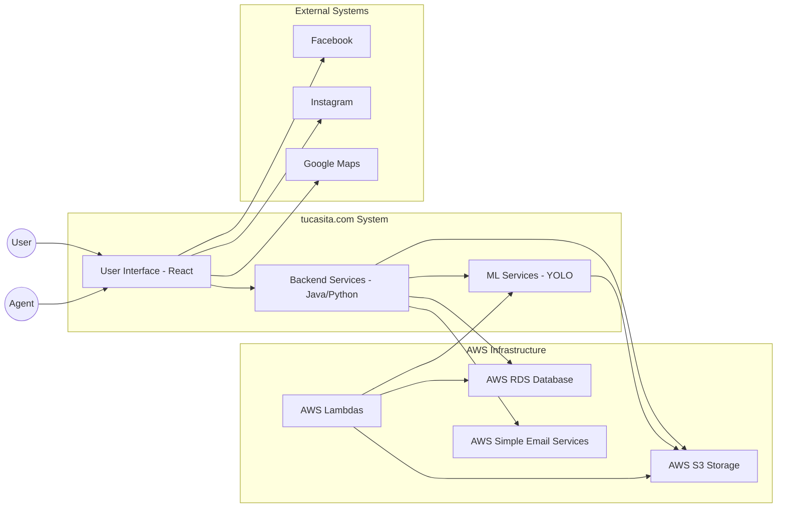

**Technical Specification for tucasita.com**

## System Context
The tucasita.com platform interacts with various external entities to provide a comprehensive real estate listing service. The major external entities involved are:



1. **End Users**: Buyers, real estate agents, and property owners who register, list properties, search for properties, and utilize the various features offered by the platform.

2. **AWS Services**: The platform uses AWS for various services such as data storage (S3 for media and RDS for structured data), computing resources (EC2, Lambda), the Machine Learning system, and email notifications through AWS Simple Email Service (SES).

3. **External Map Services**: Google Maps or similar services for location referencing and map displays.

4. **Social Media Platforms**: For sharing property listings, integration with platforms like Facebook and Instagram is necessary.

## System Architecture

### High-Level Design

1. **Web Frontend**: The main interface for users, built using the React framework. This communicates with the backend via APIs.

2. **Backend Server**: Developed using Java and Python due to their flexibility and rich library ecosystem. It handles business logic, database interactions, and serves the API for the frontend.

3. **Database**: Relational databases like PostgreSQL or MySQL to store structured data about users, properties, and other entities.

4. **AWS S3**: To store media files such as property images and videos.

5. **AWS Lambda**: For serverless computations, especially useful for scaling and asynchronous tasks like processing images for ML tagging.

6. **Machine Learning System**: Using OpenSource ML libraries in Python such as YOLO for image processing and tagging.

### Data Design

```mermaid
erDiagram

    USER ||--o{ PROPERTY_LISTINGS : "owns" 
    USER ||--o{ REVIEWS_RATINGS : "writes"
    PROPERTY_LISTINGS ||--o{ REVIEWS_RATINGS : "has"
    USER ||--o{ SEARCH_WISHLISTS : "creates"
    PROPERTY_LISTINGS ||--o{ SEARCH_WISHLISTS : "appears_in"
    
    class USER {
        int UserID PK
        string FullName
        string Email
        string Phone
        string UserType
        string Password
    }
    
    class PROPERTY_LISTINGS {
        int PropertyID PK
        string Address
        string Tags
        string MediaLinks
        int AgentID FK
    }
    
    class REVIEWS_RATINGS {
        int ReviewID PK
        string ReviewText
        int RatingValue
        int UserID FK
        int PropertyID FK
    }
    
    class SEARCH_WISHLISTS {
        int SearchWishlistID PK
        string SearchCriteria
        int UserID FK
    }
```

1. **User Data**: Contains user details like full name, email, phone number, user type (buyer or agent), and other optional fields. Each user has a unique user ID. Password storage is managed in-house.

2. **Property Listings**: Contains property details like address, tags, media links (to S3), owner/agent ID, and other specifics about the property.

3. **Reviews & Ratings**: Contains feedback provided by users, linked to a particular property or agent. Includes the review text and rating value.

4. **Search & Wish Lists**: Contains saved search criteria for users and their wish lists linking to property IDs.

### Interface Design

1. **Web Interface**: Responsive web interface compatible with desktops, tablets, and mobiles. Provides users with the ability to register, search, list properties, provide feedback, and use all other features.

2. **RESTful API**: Backend exposes a RESTful API that the frontend consumes. This API provides endpoints for all platform operations, like user registration, property listing, searching, etc.

3. **External API Integrations**: 
    - **Map Service**: An interface to integrate with Google Maps to fetch and display map data.
    - **Social Media Sharing**: Interfaces with Facebook and Instagram to share property listings.

4. **Authentication System**: An in-house developed system to handle user registrations, logins, and password management without relying on third-party solutions.